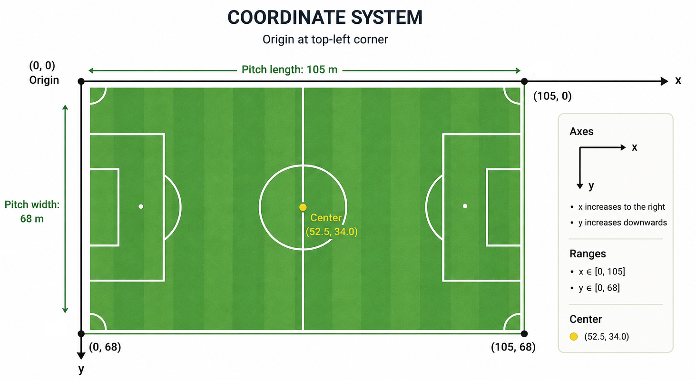

  
  
    Driblab Football Tracking Data
  

## ℹ️ About us
Driblab is a football intelligence company specialized in data collection, analytics, scouting, and decision-making tools for clubs, federations, agencies, and football professionals worldwide.

Our mission is to make high-quality football data accessible and actionable, helping organizations discover talent, evaluate performance, and gain competitive advantages through data-driven insights.

Over the years, we have built data products covering competitions across the globe, combining large-scale data collection, advanced analytics, and football expertise. This repository is part of that effort, providing access to match data from competitions that often receive limited public coverage.

Learn more about Driblab in [our website](https://www.driblab.com).

## 📁  Repository Structure
* `dataset-1`: folder with 10 games `tracking_data.jsonl` from 10 different leagues worldwide.
* `README` file.

## 💡 Overview

This repository contains football tracking data extracted from broadcast video.
Each match is stored in a single JSON Lines (.jsonl) file sampled at **10 FPS**.

The first record contains `metadata`, including **match details** (competition, date, match identifier and final score), **teams information** (home and away) and **player metadata** (player ID, name, shirt number and position).

Each subsequent record corresponds to a tracking frame and contains the `frame` identifier, the corresponding `Videotimestamp` in seconds, the match `period`,  the `match_clock` (expressed as match time in minutes and seconds, e.g. `[38, 10]`); together with the tracking information for players and the ball, and the camera projection:

### 🏃 Players
`data` contains player tracking data grouped by team, including:
* Position (`x`, `y`) 
* Velocity in km/h (`vx`, `vy`) 
* Acceleration in m/s² (`ax`, `ay`)
* Visibility flag (`vis`)

### ⚽ Ball
`ball` contains ball tracking data, including:
* Position (`x`, `y`, `z`)
* Velocity in km/h (`vx`, `vy`, `vz`) 
* Acceleration in m/s² (`ax`, `ay`, `az`) 

### 🎥 Camera projection information
 `cam` contains the polygon describing the visible pitch area for the frame.

## 📍 Coordinate System

Player and ball positions are expressed in meters using a normalized pitch coordinate system:

## 🔗 Contact us

For technical questions, bug reports, business inquiries or information about Driblab products and services, visit [our website]([Driblab](https://www.driblab.com)).

## 🛠️ Version

Current format version: 0.1379

